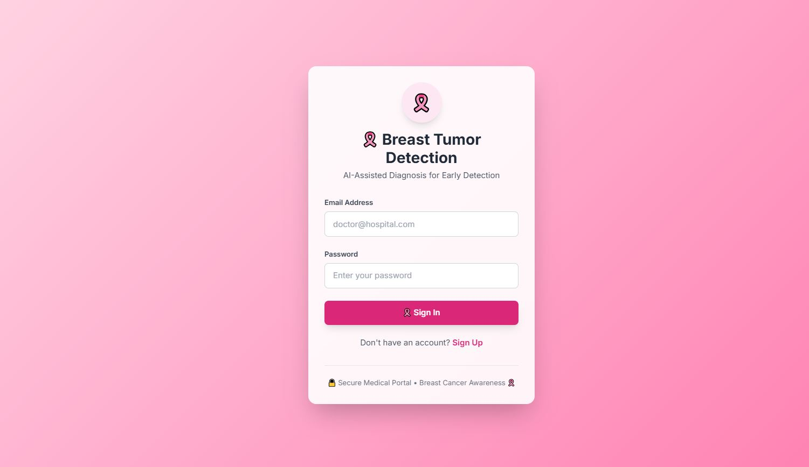
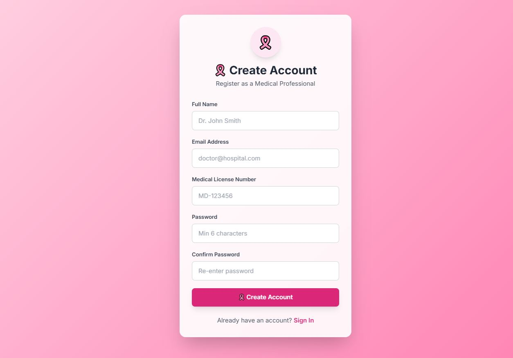
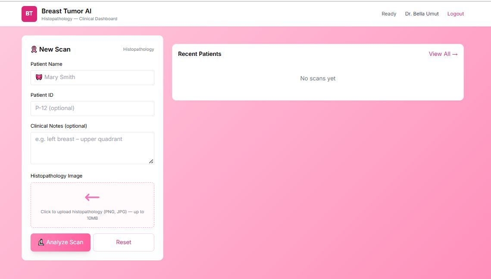
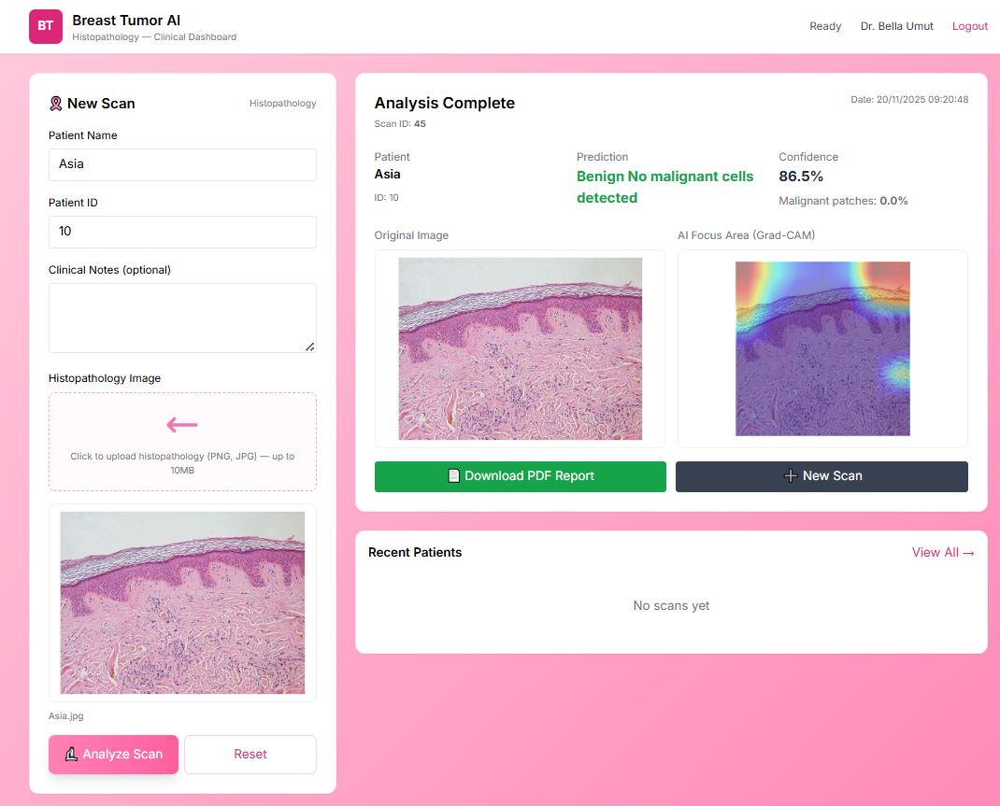
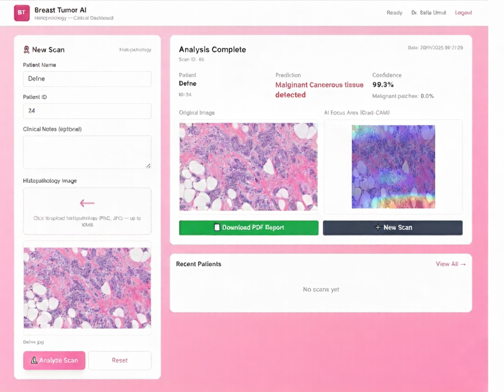
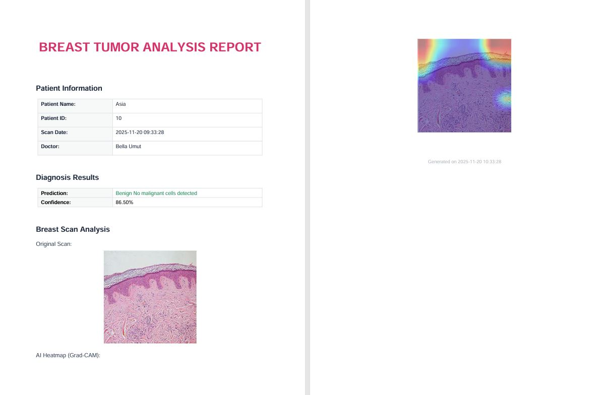

# Breast Tumor Detection AI 🎗️

AI-assisted histopathology analysis for early breast cancer detection.

This project provides a full-stack solution for medical professionals to analyze breast histopathology images using AI, visualize tumor focus areas with Grad-CAM, and generate professional PDF reports.

---

## Features

✅ **User Authentication:** Doctors can register and log in securely.  
✅ **Image Upload:** Upload histopathology scans (PNG/JPG) directly from the dashboard.  
✅ **AI Tumor Prediction:** Detects Benign or Malignant tissue with confidence score.  
✅ **Grad-CAM Visualization:** Highlights AI focus areas on the image.  
✅ **PDF Report Generation:** Download complete patient reports with images and analysis.  
✅ **Recent Scans Panel:** View and manage previously analyzed scans.  

---

## Screenshots / Preview

### Login / Signup Pages
  
  

### Dashboard: Upload & Analyze
  

### Case: Benign
  

### Case: Malignant
  

### PDF Report Sample
  

---

## Tech Stack

**Frontend:** HTML, TailwindCSS, JavaScript  
**Backend:** FastAPI (Python)  
**ML:** PyTorch / TensorFlow (your AI model)  
**PDF Generation:** fpdf Python library  
**Database:** SQLite / PostgreSQL (configurable)  
**Authentication:** JWT token-based  

---

## Start the Server

```bash
uvicorn main:app --reload
```


## Open your browser : 
http://localhost:8000/app/signup.html